# JavaScript Algorithms and Data Structure

## Table of Contents

- [The Big O Shorthands](#the-big-o-shorthands)
- [Space Complexity in JS](#space-complexity-in-js)
- [The Big O of Objects](#the-big-o-of-objects)
- [Big O of Arrays (Ordered Lists)](#big-o-of-arrays-ordered-lists)

- [Problem Solving Approach](#problem-solving-approach)

  - [What is an algorithms?](#what-is-an-algorithms)
  - [How to approach a problem?](#how-to-approach-a-problem)
    - [Understand the problem](#understand-the-problem)
    - [Explore concrete examples](#explore-concrete-examples)
    - [Break it down](#break-it-down)
    - [Solve or Simplify](#solve-or-simplify)
    - [Look Back and Refactor](#look-back-and-refactor)

- [Problem Solving Patterns](#problem-solving-patterns)

  - [Frequency Counter](#frequency-counter)
  - [Multiple Pointers](#multiple-pointers)
  - [Sliding Window](#sliding-window)
  - [Divide and Conquer](#divide-and-conquer)

- [Recursion](#recursion)

  - [The Call Stack](#the-call-stack)
  - [How Recursion Functions Work](#how-recursion-functions-work)
  - [Helper Method Recursion](#helper-method-recursion)
  - [Pure Recursion](#pure-recursion)

- [Searching Algorithms](#searching-algorithms)

- [Sorting Algorithms](#sorting-algorithms)

- [Data Structure Introduction](#data-structure-introduction)

- [Linked List](#linked-list)
  - [Singly Linked List](#singly-linked-list)
  - [Doubly Linked List](#doubly-linked-list)
- [Stack](#stack)
  - [Where Stacks are used](#where-stacks-are-used)
- [Queue](#queue)
- [Binary Search Tree](#binary-search-tree)
  - [Trees](#trees)
  - [How Trees are used](#how-trees-are-used)
  - [BST](#bst)
- [Tree Traversal](#tree-traversal)
  - [Breadth First Search - BFS](#breadth-first-search-bfs)
  - [Depth First Search - DFS](#depth-first-search-dfs)
- [Binary Heap](#binary-heap)
  - [Why should we need to know about Binary Heap?](#why-should-we-need-to-know-about-binary-heap)
  - [Max Binary Heap](#max-binary-heap)
  - [Min Binary Heap](#min-binary-heap)
  - [Priority Queue](#priority-queue)
- [Hash Tables](#hash-tables)
  - [Hash Function](#hash-function)
  - [Hash Collision](#hash-collision)
- [Graphs](#graphs)
  - [What is Graphs?](#what-is-graphs)
  - [How Graphs are used](#how-graphs-are-used)
  - [Graph Terminology](#graph-terminology)
  - [Graph Representation](#graph-representation)
    - [Adjacency Matrix](#adjacency-matrix)
    - [Adjacency List](#adjacency-list)
- [Dijkastra's Algorithm](#dijkastras-algorithm)
  - [What is Dijkastra's Algorithm?](#what-is-dijkastras-algorithm)
  - [Why is it useful?](#why-is-it-useful)
- [Dynamic Programming](#dynamic-programming)
  - [Overlapping Sub-Problems](#overlapping-sub-problems)
  - [Optimal Sub-Structure](#optimal-sub-structure)
  - [Memoization](#memoization)
  - [Tabulation](#tabulation)

## The Big O Shorthands

- Arithmetic operations are constant
- Variable assignment is constant
- Accessing elements in an array (by index) or object (by key) is constant
- In a loop, the complexity is the length of the loop times the complexity of whatever happens inside of the loop

## Space Complexity in JS

- Most primitives (booleans, numbers, undefined, null) are constant space
- Strings require O(n) space (where n is the string length)
- Reference types are generally O(n), where n is the length (for arrays) or the number of keys (for objects)

## The Big O of Objects

- When to use objects

  - When you don't need order
  - When you need fast access / insertion and removal

| **Big O of Objects / Object Methods** | **Time Complexity** |
| ------------------------------------- | ------------------- |
| Insertion                             | O(1)                |
| Removal                               | O(1)                |
| Searching                             | O(n)                |
| Access                                | O(1)                |
| Object.keys                           | O(n)                |
| Object.values                         | O(n)                |
| Object.entries                        | O(n)                |
| hasOwnProperty                        | O(1)                |

## Big O of Arrays (Ordered Lists)

- When to use arrays
  - When you need order
  - When you need fast access / insertion and removal

| **Big O of Arrays / Array Methods** | **Time Complexity** |
| ----------------------------------- | ------------------- |
| Insertion                           | It depends          |
| Removal                             | It depends          |
| Searching                           | O(n)                |
| Access                              | O(1)                |
| push                                | O(1)                |
| pop                                 | O(1)                |
| shift                               | O(n)                |
| unshift                             | O(n)                |
| concat                              | O(n)                |
| slice                               | O(n)                |
| splice                              | O(n)                |
| sort                                | O(n \* log n)       |
| forEach/map/filter/reduce/etc.      | O(n)                |

## Problem Solving Approach

### What is an algorithms?

- A **process** or **set of steps** to accomplish a certain task

### How to approach a problem?

- Devise a plan for solving problems
- Master common problem solving patterns
- Understand the problem
- Explore concrete examples
- Break it down
- Solve/Simplify
- Look back and refactor

#### Understand the problem

1. Can I restate the problem in my own words?
2. What are the inputs that go into the problem?
3. What are the outputs that should come from the solution to the problem?
4. Can the outputs be determined from the inputs? In other words, do I have enough information to solve the problem?
5. How should I label the important pieces of data that are a part of the problem?

#### Explore concrete examples

1. Start with simple examples
2. Progress to more complex examples
3. Explore examples with empty inputs
4. Explore examples with invalid inputs

#### Break it down

- Explicitly write out the steps you need to take. This force you to think about the code you'll write before you write it, and helps you catch any lingering conceptual issues or misunderstandings before you dive in and have worry about details as well

#### Solve or Simplify

- Solve the problem if you can not solve a simpler problem
- Find the core difficulty in what you're trying to do
- Temporarily ignore that difficulty
- Write a simplified solution
- Then incorporate that difficulty back in

#### Look Back and Refactor

- Refactoring questions
  - Can you check the result?
  - Can you derive the result differently?
  - Can you understand it at a glance?
  - Can you use the result or method for some other problem?
  - Can you improve performance of your solution?
  - Can you think of other ways to refactor?
  - How have other people solved this problem?

## Problem Solving Patterns

- Some patterns:
  - Frequency Counter
  - Multiple Pointers
  - Sliding Window
  - Divide and Conquer
  - Dynamic Programming
  - Greedy Algorithms
  - Backtracking

### Frequency Counter

- This pattern uses objects or sets to collect values/frequencies of values
- This can often avoid the need for nested loops or O(n^2) operations with array/strings
- [See the example](./Problem%20Solving%20Pattern%20Examples/Frequency%20Pointer%20Pattern/)

### Multiple Pointers

- Create pointers or values that correspond to an index or position and move towards the beginning, end or middle based on a certain condition
- Very efficient for solving problems with minimal space complexity as well
- [See the example](./Problem%20Solving%20Pattern%20Examples/Multiple%20Pointer%20Pattern/)

### Sliding Window

- This pattern involves creating a **window** which can either be an array or number form one position to another
- Depending on a certain condition, the window either increases or closes (and a new window is created)
- This pattern is very useful for keeping track of a subset of data in an array/string, etc.
- [See the example](./Problem%20Solving%20Pattern%20Examples/Sliding%20Window%20Pattern/)

### Divide and Conquer

- This pattern involves dividing a data set into smaller chunks and the repeating a process with a subset of data
- This pattern can tremendously decrease time complexity
- [See the example](./Problem%20Solving%20Pattern%20Examples/Divide%20and%20Conquer%20Pattern/)

## Recursion

- The recursion is a **process (function)** that **calls itself**
- [See the example](./Recursion%20Examples/)

### The Call Stack

- A **call stack** is a mechanism for an interpreter (like the JavaScript interpreter in a web browser) to keep track of its place in a script that calls multiple functions
- Any time a function is invoked, it's placed (**pushed**) on the top of the stack
- When JavaScript sees the **return** keyword or when the function ends, the compiler will remove (**pop**) function out of the stack

### How Recursion Functions Work

- We invoke the **same** function with a different input until you reach your **base case**
- The **base case** is the condition when the recursion ends
- In summary, 2 essential parts of a recursion function are base case and different input

### Helper Method Recursion

- A helper method is a **recursive method** that makes use of additional parameters to keep track of values. It is any method you use to help in the execution of other methods or functions and which is not used outside of that context

```js
function outer(input) {
  let outerScopedVariable = [];

  function helper(helperInput) {
    // Modify the outerScopedVariable
    helper(helperInput--);
  }

  helper(input);

  return outerScopedVariable;
}
```

- [See the example](./Recursion%20Examples/helper-method-example.js)

### Pure Recursion

- A function is pure if it does not change any non-local variables, read files or network connections, or make any output
- A function qualifies as a pure function if:

  - It will always return the same result if given the same arguments. This is also known as referential transparency. This means that pure functions rely on their own arguments and immutable values to determine their return value. For example, mathematical functions are considered to be referentially transparent .
  - It doesn’t produce any side effects. What this means is that a function does not change the association between its name and value within a given scope. Side effects are harmful because they introduce uncertainty to the code. Consequently, this leads to difficulty tracing and debugging should an issue arise.

- [See the example](./Recursion%20Examples/pure-recursion-example.js)

## Searching Algorithms

| Searching Algorithms                                          | Best case | Average Case | Worst Case | Examples                                                                  |
| ------------------------------------------------------------- | --------- | ------------ | ---------- | ------------------------------------------------------------------------- |
| [Linear Search](https://www.geeksforgeeks.org/linear-search/) | O(1)      | O(n)         | O(n)       | [See example of linear search](./Searching%20Algorithms/linear-search.js) |
| [Binary Search](https://www.geeksforgeeks.org/binary-search/) | O(1)      | O(log n)     | O(log n)   | [See example of binary search](./Searching%20Algorithms/binary-search.js) |

- [Read more about searching algorithms](https://www.geeksforgeeks.org/searching-algorithms/)

## Sorting Algorithms

- Sorting is the process of rearranging the items in a collection (e.g. an array) so that the items are in some kind of order

| Searching Algorithms                                            | Best case                                                                | Average Case | Worst Case | Space Complexity | Examples                                                                  |
| --------------------------------------------------------------- | ------------------------------------------------------------------------ | ------------ | ---------- | ---------------- | ------------------------------------------------------------------------- |
| [Bubble Sort](https://www.geeksforgeeks.org/bubble-sort/)       | O(n)                                                                     | O(n^2)       | O(n^2)     | O(1)             | [See example of bubble sort](./Sorting%20Algorithms//Bubble%20Sort/)      |
| [Insertion Sort](https://www.geeksforgeeks.org/insertion-sort/) | O(n)                                                                     | O(n^2)       | O(n^2)     | O(1)             | [See example of insertion sort](./Sorting%20Algorithms/Insertion%20Sort/) |
| [Selection Sort](https://www.geeksforgeeks.org/selection-sort/) | O(n^2)                                                                   | O(n^2)       | O(n^2)     | O(1)             | [See example of selection sort](./Sorting%20Algorithms/Selection%20Sort/) |
| [Merge Sort](https://www.geeksforgeeks.org/merge-sort/)         | O(n log n)                                                               | O(n log n)   | O(n log n) | O(n)             | [See example of merge sort](./Sorting%20Algorithms/Merge%20Sort/)         |
| [Quick Sort](https://www.geeksforgeeks.org/quick-sort/)         | O(n log n)                                                               | O(n log n)   | O(n^2)     | O(log n)         | [See example of quick sort](./Sorting%20Algorithms/Quick%20Sort/)         |
| [Radix Sort](https://www.geeksforgeeks.org/radix-sort/)         | O(nk) (n - length of the array, k - number of digits (average))          | O(nk)        | O(nk)      | O(n + k)         | [See example of radix sort](./Sorting%20Algorithms/Radix%20Sort/)         |
| [Counting Sort](https://www.geeksforgeeks.org/counting-sort/)   | O(n + k) (n - length of the array, k - the maximum element of the array) | O(n + k)     | O(n + k)   | O(n + k)         | [See example of radix sort](./Sorting%20Algorithms/Radix%20Sort/)         |

- [Read more about sorting algorithms](https://www.geeksforgeeks.org/sorting-algorithms/)
- [Sorting Algorithms Animations](https://www.toptal.com/developers/sorting-algorithms)
- [Visualgo - Sorting Algorithms](https://visualgo.net/en/sorting)

### Sorting Stability

- In sorting algorithms, stability refers to whether the algorithm preserves the original order of elements with equal keys (sorting criteria) during the sorting process.

- Stable Sorting Algorithm: A sorting algorithm is considered stable if, for any two elements a and b in the original array, where a appears before b and they both have the same key value (the value used for sorting), then a will also appear before b in the sorted output array. In simpler terms, a stable sorting algorithm maintains the relative order of elements with the same sorting value.

- Unstable Sorting Algorithm: An unstable sorting algorithm might not preserve the original order of elements with equal keys. The order of such elements in the sorted output might be different from their order in the original array.

## Data Structure Introduction

- A data structure is a storage that is used to store and organize data. It is a way of arranging data on a computer so that it can be accessed and updated efficiently.
- Data structure are collections of values, the relationships among them, and the functions or operations that can be applied to the data

- [Data Structures](https://www.geeksforgeeks.org/data-structures/)
- [What is Data Structure: Types, Classifications and Applications](https://www.geeksforgeeks.org/what-is-data-structure-types-classifications-and-applications/)

## Linked List

- Linked list is a data structure that contains a `head`, `tail` and `length` property
- It consists of nodes, and each `node` has a `value` and a `pointer` to another node or null
- A `node` stores piece of data

| Linked List                               | Array                                       |
| ----------------------------------------- | ------------------------------------------- |
| Do not have indexes                       | Indexed in order                            |
| Connected via nodes with a `next` pointer | Insertion and deletion can be expensive     |
| Random access is not allowed              | Can quickly be accessed at a specific index |

- [Learn more about Linked List](https://www.geeksforgeeks.org/data-structures/linked-list/)

### Singly Linked List

- A singly linked list is a linear data structure in which the elements are not stored in contiguous memory locations and each element is connected only to its next element using a pointer.

- Singly Linked Lists are an excellent alternative to arrays when insertion and deletion at the beginning are frequently required

- Arrays contain a built in index whereas Linked Lists do not
- The idea of a list data structure that consists of nodes is the foundation for other data structures like `Stacks` and `Queues`

| Singly Linked List Methods | Time Complexity           |
| -------------------------- | ------------------------- |
| Insertion                  | O(1)                      |
| Removal                    | O(1) or O(n) (It depends) |
| Searching                  | O(n)                      |
| Accessing                  | O(n)                      |

- [Learn more about Singly Linked List](https://www.geeksforgeeks.org/data-structures/linked-list/singly-linked-list/)
- [See the example of Singly Linked List](./Data%20Structures/Linked%20Lists/Singly%20Linked%20List/)

### Doubly Linked List

- A doubly linked list (DLL) is a special type of linked list in which each node contains a pointer to the previous node as well as the next node of the linked list. Therefore, in a doubly linked list, a node consists of three parts: node data, pointer to the next node in sequence (next pointer) , pointer to the previous node (previous pointer).

| Doubly Linked List Methods | Time Complexity |
| -------------------------- | --------------- |
| Insertion                  | O(1)            |
| Removal                    | O(1)            |
| Searching                  | O(n)            |
| Accessing                  | O(n)            |

- [Learn more about Doubly Linked List](https://www.geeksforgeeks.org/data-structures/linked-list/doubly-linked-list/)
- [See the example of Doubly Linked List](./Data%20Structures/Linked%20Lists/Doubly%20Linked%20List/)

## Stack

- Stack is a linear data structure that follows a particular order in which the operations are performed. The order may be `LIFO(Last In First Out)` or `FILO(First In Last Out)`.
- `LIFO` implies that the element that is `inserted last, comes out first` and `FILO` implies that the element that is `inserted first, comes out last`.

| Big O of Stack Methods | Time Complexity |
| ---------------------- | --------------- |
| Insertion              | O(1)            |
| Removal                | O(1)            |
| Searching              | O(n)            |
| Accessing              | O(n)            |

- [Learn more about Stack](https://www.geeksforgeeks.org/stack-data-structure/)
- [See the example of Stack](./Data%20Structures/Stack)

### Where Stacks are used

- Managing [function invocations](https://www.geeksforgeeks.org/javascript-function-invocation/)
- Undo / Redo functionality
- Routing (the history object) is treated like a stack

## Queue

- A Queue is defined as a linear data structure that is open at both ends and the operations are performed in `First In First Out (FIFO)` order.

- How do we use queue in programming?

  - Background tasks
  - Uploading resources
  - Printing / Task processing

| Stack Methods | Time Complexity |
| ------------- | --------------- |
| Insertion     | O(1)            |
| Removal       | O(1)            |
| Searching     | O(n)            |
| Accessing     | O(n)            |

- [Learn more about Queue](https://www.geeksforgeeks.org/queue-data-structure/)
- [See the example of Queue](./Data%20Structures/Queues)

## Binary Search Tree

### Trees

- Tree Terminology

  - **Root**: the top node in a tree
  - **Child**: a node directly connected to another node when moving away from the Root
  - **Parent**: the converse notion of a child
  - **Siblings**: a group of nodes with the same parent
  - **Leaf**: a node with no children
  - **Edge**: the connection between one node and another

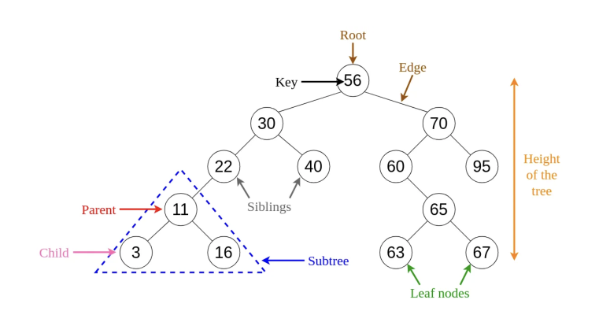

### How Trees are used?

- Trees are used in computer science for various tasks, including storing information, representing hierarchical data, and providing efficient algorithms for operations such as insertion, deletion, and searching.

- For examples: [HTML DOM](https://en.wikipedia.org/wiki/Document_Object_Model), [Network Routing](https://en.wikipedia.org/wiki/Routing), [Abstract Syntax Tree](https://en.wikipedia.org/wiki/Abstract_syntax_tree), [Folders in OS](https://www.geeksforgeeks.org/structures-of-directory-in-operating-system/), [JSON](https://en.wikipedia.org/wiki/JSON), etc.

- Kinds of Trees: Trees, Binary Trees, Binary Search Trees

### BST

- Every parent node has at most `2 children`
- Every node to the `left` of a parent node is always `less than` the parent
- Every node to the `right` of a parent node is always `greater than` the parent

| Big O of BST | Time Complexity |
| ------------ | --------------- |
| Insertion    | O(log n)        |
| Searching    | O(log n)        |

- [Learn more about BST](https://www.geeksforgeeks.org/binary-search-tree-data-structure/)
- [BST Visualization](https://visualgo.net/en/bst?slide=1)
- [See the example of BST](./Binary%20Search%20Trees/)

## Tree Traversal

- Tree traversal, also known as tree search, is a process of `visiting each node` of a tree data structure. During tree traversal, you visit each node of a tree `exactly once` and perform an operation on the nodes like checking the node data (search) or updating the node.

- Tree traversal algorithms can be classified broadly in the following two categories by the order in which the nodes are visited:

  - **Depth-first search (DFS) algorithm**: It starts with the root node and first visits all nodes of one branch as deep as possible before backtracking. It visits all other branches in a similar fashion. There are three subtypes under this that we will cover in this article.
  - **Breadth-first search (BFS) algorithm**: This also starts from the root node and visits all nodes of current depth before moving to the next depth in the tree. We will cover one algorithm of BFS type in the upcoming section.

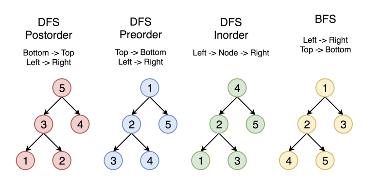

- [Learn more about Tree Traversal from GeeksforGeeks](https://www.geeksforgeeks.org/tree-traversals-inorder-preorder-and-postorder/)
- [Read more about 4 Types of Tree Traversal Algorithms from Built in](https://www.geeksforgeeks.org/tree-traversals-inorder-preorder-and-postorder/)
- [Difference between BFS and DFS from GeeksforGeeks](https://www.geeksforgeeks.org/difference-between-bfs-and-dfs/)

### Breadth First Search (BFS)

- The `Breadth First Search (BFS) algorithm` is used to search a `graph data structure` for a node that meets a set of criteria. It starts at the root of the graph and visits all nodes at the current depth level before moving on to the nodes at the next depth level.

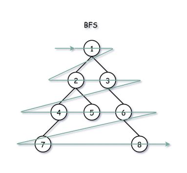

- [Learn more about Breadth First Search from GeeksforGeeks](https://www.geeksforgeeks.org/breadth-first-search-or-bfs-for-a-graph/)
- [See the example of BFS](./Binary%20Search%20Trees/)

### Depth First Search (DFS)

- `Depth First Traversal (or DFS)` for a graph is similar to `Depth First Traversal` of a tree. It's a recursive algorithm for searching all the vertices of a graph or tree data structure. `Traversal` means visiting all the nodes of a graph. Unlike trees, `graphs` may contain cycles (a node may be visited twice). To avoid processing a node more than once, use a boolean visited array. A graph can have more than one DFS traversal.

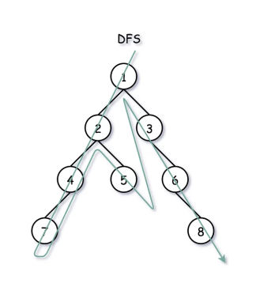

- [Learn more about Depth First Search from GeeksforGeeks](https://www.geeksforgeeks.org/depth-first-search-or-dfs-for-a-graph/)
- [See the example of DFS](./Binary%20Search%20Trees/)

## Binary Heap

- A binary heap is a `heap` data structure that takes the form of a `binary tree` (a tree in which each node has at most two children) which satisfies the following additional constraints:

  - The binary tree is complete, i.e. every level except the `bottom-most (deepest one) level` is completely filled and if the last level of the tree is not complete, then the nodes of the bottom-most level are filled from `left to right`.
  - `Max-heap` property: The key of every node is `larger` than or `equal` to its children.
  - In a `Max Binary Heap`, parent nodes are always larger then child nodes, and in a `Min Binary Heap`, parent nodes are always smaller than child nodes

| Big O of Binary Heaps | Time Complexity |
| --------------------- | --------------- |
| Insertion             | O(log n)        |
| Removal               | O(log n)        |
| Searching             | O(n)            |

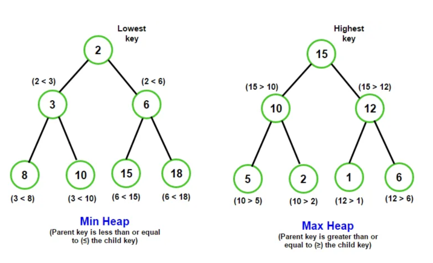

- [Binary Heap visualization - VisualAlgo](https://visualgo.net/en/heap?slide=1)
- [Learn more about Binary Heap from GeeksforGeeks](https://www.geeksforgeeks.org/binary-heap/)
- [Learn more about Binary Heap from Wikipedia](https://en.wikipedia.org/wiki/Binary_heap)
- [Difference between Min Heap & Max Heap - GeeksforGeeks](https://www.geeksforgeeks.org/difference-between-min-heap-and-max-heap/)

### Why should we need to know about Binary Heap?

- Binary Heap has `constant time` (`O(1)`) time complexity, this means that we know where the value will be no matter what data structure we use
- Binary Heaps are used to implement `Priority Queues` or `Schedulers`, where the earliest item is desired
- They are also used quite a bit, with `graph traversal` algorithms

### Max Binary Heap

- Each parent has at most 2 child nodes
- The value of each parent node is `always greater ` than its child nodes
- The parent is `greater` than the children, but there are `no guarantees between sibling nodes`
- A binary heap is as compact as possible. All the children of each node are as full as they can be and `left children are filled out first`

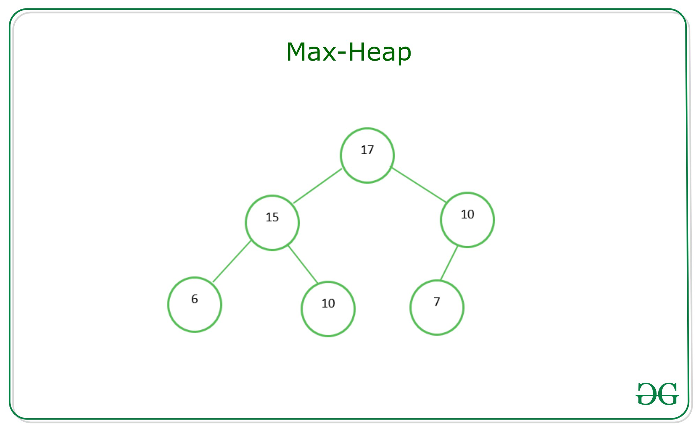

- [See the example of Max Binary Heap](./Binary%20Heap/)

### Min Binary Heap

- Each parent has at most 2 child nodes
- The value of each parent node is `always less` than its child nodes
- The parent is `less` than the children, but there are `no guarantees between sibling nodes`
- A binary heap is as compact as possible. All the children of each node are as full as they can be and `left children are filled out first`


- [See the example of Min Binary Heap](./Binary%20Heap/)

### Priority Queue

- Priority Queue is a data structure where each element has a `priority`. Elements with `higher` priorities are `served before` elements with `lower` priorities

- [Learn more about Priority Queue from GeeksforGeeks](https://www.geeksforgeeks.org/priority-queue-set-1-introduction/)
- [See the example of Priority Queue](./Binary%20Heap/)

## Hash Tables

- A `hash table (aka hash map)` is a data structure that implements an associative `array` or `dictionary`. It is an abstract data type that maps `keys` to `values`. A hash table uses a hash function to compute an `index`, also called a `hash code`, into an array of buckets or slots, from which the desired value can be found. During lookup, the key is hashed and the resulting hash indicates where the corresponding value is stored.
- Hash tables are used to store `key-value` pairs, with the keys are not ordered
- Unlike arrays, hash tables are `fast` for all of the following operations: `finding values`, `adding new values`, and `removing values`
- In a hash table, a new `index` is processed using the `keys`. And, the element corresponding to that key is stored in the index. This process is called `hashing`.

| Big O of Hash Tables | Time Complexity (average cases) |
| -------------------- | ------------------------------- |
| Insertion            | O(1)                            |
| Deletion             | O(1)                            |
| Accessing            | O(1)                            |

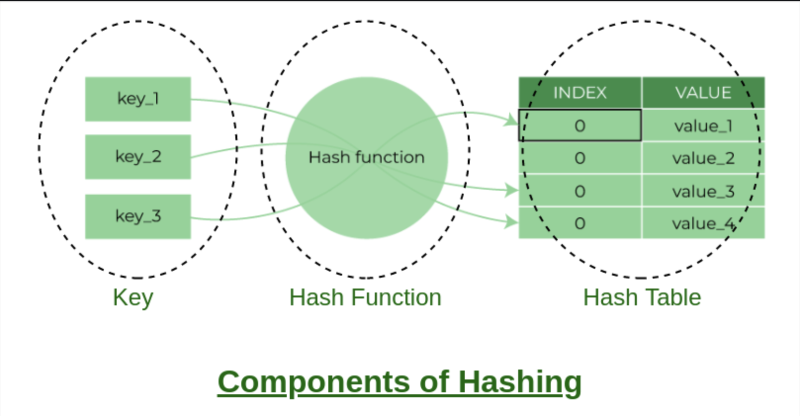

- [Hash table - Wikipedia](https://en.wikipedia.org/wiki/Hash_table)
- [Hashing Data Structure - Geeksforgeeks](https://www.geeksforgeeks.org/hashing-data-structure/)
- [Hash Table - Programiz](https://www.programiz.com/dsa/hash-table)
- [See the example of Hash Tables](./Hash%20Tables/)

### Hash Function

- The hash function creates a mapping between `key` and `value`, this is done through the use of `mathematical formulas` known as hash functions. The result of the hash function is referred to as a `hash value` or `hash`. The hash value is a representation of the `original string` of characters but usually `smaller` than the original.

- Using a prime number for the size of a hash table array can help to `reduce collisions` and `improve performance`. Prime numbers are `not divisible` by any other number other than `1 and itself`, so they are `less likely to have a common factor` with the hash code of an object being inserted into the table. This means that there is a `lower chance of two objects being assigned to the same slot` in the array, which can lead to fewer collisions and faster retrieval times. Additionally, using a prime number allows for a more evenly distributed hash code, which can also help to reduce collisions.

- [Prime numbers — and why blockchains can’t exist without them! - Medium](https://levelup.gitconnected.com/prime-numbers-and-why-blockchains-cant-exist-without-them-f629bdc54bb3)
- [Why Should the Length of Your Hash Table Be a Prime Number? - Medium](https://medium.com/swlh/why-should-the-length-of-your-hash-table-be-a-prime-number-760ec65a75d1)
- [Does making array size a prime number help in hash table implementation? Why? - Quora](https://www.quora.com/Does-making-array-size-a-prime-number-help-in-hash-table-implementation-Why)

### Hash Collision

- `Hash collision` happens when the hash function generates the `same index for multiple keys`, there will be a conflict (what value to be stored in that index). To resolve the has collision, we can use one of the following techniques:

  - `Collision resolution by chaining`: In chaining, if a hash function produces the same index for multiple elements, these elements are `stored` in the same index by using a `doubly-linked list`
  - `Open Addressing - Linear/Quadratic Probing and Double Hashing`: Open addressing doesn't store multiple elements into the same slot. Here, each slot is either `filled` with a `single key` or left `NIL`

    - **Linear Probing**: In linear probing, the hash table is searched sequentially that starts from the original location of the hash. If in case the location that we get is already occupied, then we check for the next location.

    - **Quadratic Probing (aka Mid-Square method)**: Quadratic probing operates by taking the original hash index and adding successive values of an arbitrary quadratic polynomial until an open slot is found.

    - **Double Hashing**: Double hashing make use of two hash function
      - The first hash function is **h1(k)** which takes the key and gives out a location on the hash table. But if the new location is not occupied or empty then we can easily place our key.
      - But in case the location is occupied (collision) we will use secondary hash-function **h2(k)** in combination with the first hash-function **h1(k)** to find the new location on the hash table.

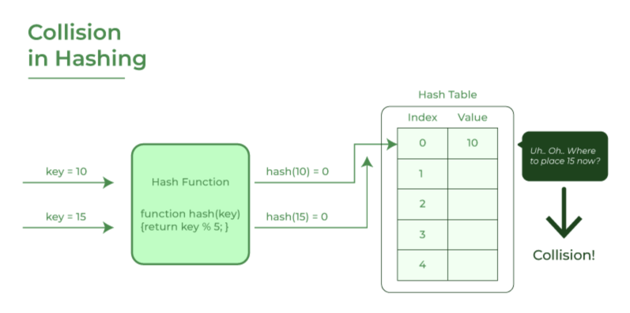

## Graphs

### What is Graphs?

- A graph data structure consists of a `finite` (and possibly mutable) set of `vertices` (or `nodes`) together with a set of `unordered pairs` of these `vertices` for an `undirected graph` or a set of `ordered pairs` for a `directed graph`

- A Graph is a `non-linear` data structure consisting of `vertices` and `edges`. It is a `collection of nodes` that have data and are `connected to other nodes`. The `vertices` are sometimes also referred to as `nodes` and the `edges` are `lines` or `arcs` that connect `any two nodes` in the graph. More formally a Graph is composed of a set of `vertices( V )` and a set of `edges( E )`.The graph is denoted by `G(E, V)`.

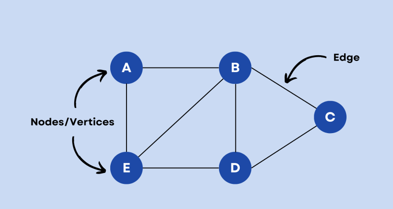

**Big O of Graphs**

- `|V|`: number of vertices
- `|E|`: number of edges

| **Big O of Graphs** | **Adjacency List** | **Adjacency Matrix** |
| ------------------- | ------------------ | -------------------- |
| Add Vertex          | O(1)               | O(V^2)               |
| Add Edge            | O(1)               | O(1)                 |
| Remove Vertex       | O(V + E)           | O(V^2)               |
| Remove Edge         | O(E)               | O(1)                 |
| Query               | O(V + E)           | O(1)                 |
| Storage             | O(V + E)           | O(V^2)               |

| **Adjacency List**                        | **Adjacency Matrix**                  |
| ----------------------------------------- | ------------------------------------- |
| Can take up less space (in sparse graphs) | Take up more space (in sparse graphs) |
| Faster to iterate over all edges          | Slower to iterate over all edges      |
| Can be slower to lookup specific edge     | Faster to lookup specific edge        |

- [Learn more about Graphs - GeeksforGeeks](https://www.geeksforgeeks.org/graph-data-structure-and-algorithms/)
- [Learn more about Graphs - Programiz](https://www.programiz.com/dsa/graph)
- [Learn more about Graphs - Wikipedia](<https://en.wikipedia.org/wiki/Graph_(abstract_data_type)>)
- [See the example of Graphs](./Graphs/)

### How Graphs are used?

- Social Networks
- Location / Mapping
- Routing Algorithms
- Visual Hierarchy
- File System Optimization
- etc...

### Graph Terminology

- **Adjacency**: A vertex is said to be adjacent to another vertex if there is an edge connecting them.
- **Path**: A sequence of edges that allows you to go from `vertex A` to `vertex B` is called a `path`.
- **Directed Graph**: A `directed graph` is a set of `vertices (nodes)` connected `by edges`, with each node having a direction associated with it. A graph in which an `edge (u,v)` doesn't necessarily mean that there is an edge (v, u) as well. The `edges` in such a graph are `represented by arrows` to show the `direction of the edge`.
- **Undirected Graph**: In an `undirected graph` the `edges` are `bidirectional`, with no direction associated with them. Hence, the graph can be traversed in either direction. The absence of an arrow tells us that the graph is undirected.

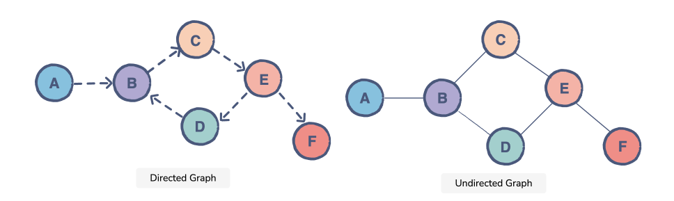

- **Weighted Graph**: A `weighted graph` is defined as a special type of graph in which the edges are assigned some weights which represent cost, distance, and many other relative measuring units.
- **Unweighted Graph**: An unweighted graph is `a graph in which the edges do not have weights or costs associated with them`. Instead, they simply represent the presence of a connection between two vertices

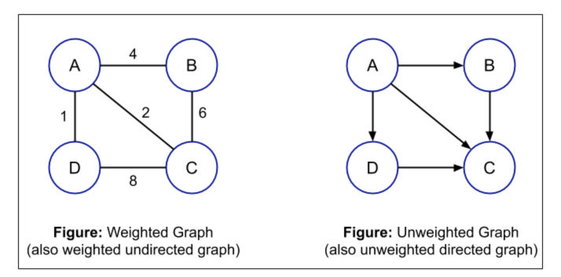

- [Learn more about Weighted Graph - GeeksforGeeks](https://www.geeksforgeeks.org/applications-advantages-and-disadvantages-of-weighted-graph/)
- [Learn more about Unweighted Graph - GeeksforGeeks](https://www.geeksforgeeks.org/applications-advantages-and-disadvantages-of-unweighted-graph/)

### Graph Representation

#### Adjacency Matrix

- An adjacency matrix is a 2D array of `V x V` vertices. Each row and column represent a vertex. If the value of any element `a[i][j]` is `1`, it represents that there is an `edge` connecting vertex i and vertex j.

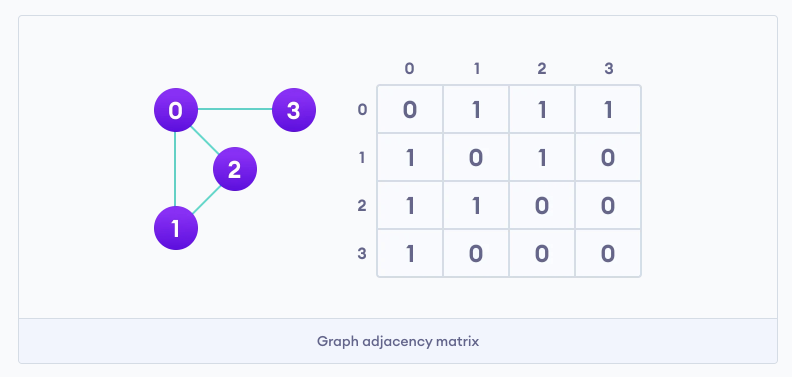

#### Adjacency List

- An adjacency list represents a graph as an array of linked lists. The index of the array represents a vertex and each element in its linked list represents the other vertices that form an edge with the vertex.

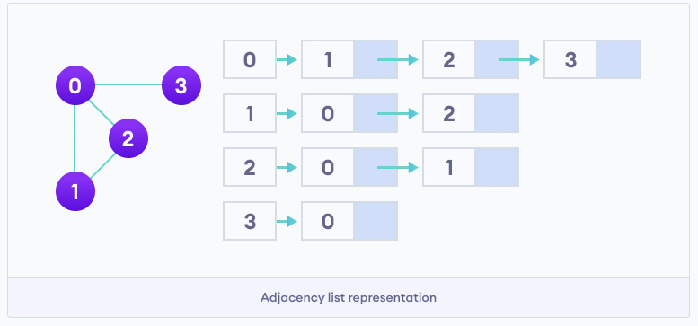

### Graph Traversal

- Graph traversal is a technique used to `search` for a `vertex` in a `graph`. It is also used to `decide` the `order of vertices` to be visited in the search process. A graph traversal `finds the edges` to be used in the search process `without creating loops`.

- [Learn more about Graph Traversal - Wikipedia](https://en.wikipedia.org/wiki/Graph_traversal)
- [DFS & BFS Visualization - Visualgo](https://visualgo.net/en/dfsbfs)

#### Graph Traversal Uses

- Peer to peer networking
- Web crawlers
- Finding `closest` matching / recommendations
- Shortest path problems
  - GPS Navigation
  - Solving mazes
  - AI (shortest path to win the game)

## Dijkastra's Algorithm

### What is Dijkastra's Algorithm?

- Dijkastra's Algorithm was created by `Edsger Dijkastra`, a Dutch programmer, physicist, essayist, and all-around smarty-pants. He helped to advance the field of computer science from an art to an academic discipline
- Dijkstra's Algorithm is a shortest path algorithm which finds the `shortest path between 2 vertices on a graph`
- This algorithm uses the `weights of the edges` to find the path that minimizes the total distance (weight) between the root node and all other nodes

- [Learn more about Dijkastra's Algorithm - Wikipedia](https://en.wikipedia.org/wiki/Dijkstra's_algorithm)
- [Learn more about Dijkastra's Algorithm - Programiz](https://www.programiz.com/dsa/dijkstra-algorithm)
- [Dijkstra's Shortest Path Algorithm - A Detailed and Visual Introduction - Freecodecamp](https://www.freecodecamp.org/news/dijkstras-shortest-path-algorithm-visual-introduction/)
- [See the example of Dijkastra's Algorithm](./Dijkstra's%20Algorithm/)

### Why is it useful?

- It's commonly used such as:
  - GPS - find fastest route
  - Network Routing - finds open shortest path for data
  - Biology - used to model the spread of viruses among humans
  - Airline tickets - finding cheapest route to your destination
  - Many other uses!

## Dynamic Programming

- Dynamic Programming is a method for solving a complex problem by `breaking it down into a collection of simpler sub-problems`, solving each of those sub-problems just once, and storing their solutions

- [Learn more about Dynamic Programming - GeeksforGeeks](https://www.geeksforgeeks.org/dynamic-programming/)
- [Learn more about Dynamic Programming - Wikipedia](https://en.wikipedia.org/wiki/Dynamic_programming)
- [Learn more about Dynamic Programming - Programiz](https://www.programiz.com/dsa/dynamic-programming)
- [See the example of Dynamic Programming](./Dynamic%20Programming)

### Overlapping Sub-Problems

- A problem is said to have `overlapping sub-problems` if it can be broken down into `sub-problems` which are `reused` several times

- [Learn more about Overlapping Sub-Problems - Wikipedia](https://en.wikipedia.org/wiki/Overlapping_subproblems)
- [Learn more about Overlapping Sub-Problems - GeeksforGeeks](https://www.geeksforgeeks.org/overlapping-subproblems-property-in-dynamic-programming-dp-1/)

### Optimal Sub-Structure

- A problem is said to have `optimal sub-structure` if an optimal solution can be `constructed` from optimal solutions of its sub-problems

- [Learn more about Optimal Sub-Structure - Wikipedia](https://en.wikipedia.org/wiki/Optimal_substructure)
- [Learn more about Optimal Sub-Structure - GeeksforGeeks](https://www.geeksforgeeks.org/optimal-substructure-property-in-dynamic-programming-dp-2/)
- [Learn more about Optimal Sub-Structure - labuladong](https://labuladong.gitbook.io/algo-en/i.-dynamic-programming/optimalsubstructure)

### Memoization

- Storing the results of expensive function calls and returning the cached result when the same inputs occur again
- It is a `Top-down method`

- [What is memoization? - GeeksforGeeks](https://www.geeksforgeeks.org/what-is-memoization-a-complete-tutorial/)
- [See the example of Memoization](./Dynamic%20Programming/fibonacci.js)

### Tabulation

- Storing the result of a previous result in a `table` (usually an array)
- Usually done using `iteration`
- It is a `Bottom-up method`. We start solving the problems from the base cases (bottom) and gathering answers to the top
- Better `space complexity`

- [Memoization vs Tabulation - GeeksforGeeks ](https://www.geeksforgeeks.org/tabulation-vs-memoization/)
- [Memoization vs Tabulation in DP - Medium](https://medium.com/@aryan.jain19/memoization-vs-tabulation-in-dp-4ff137da8044)
- [Memoization vs Tabulation - codingninjas](https://www.codingninjas.com/studio/library/memoization-vs-tabulation)
- [See the example of Tabulation](./Dynamic%20Programming/fibonacci.js)
