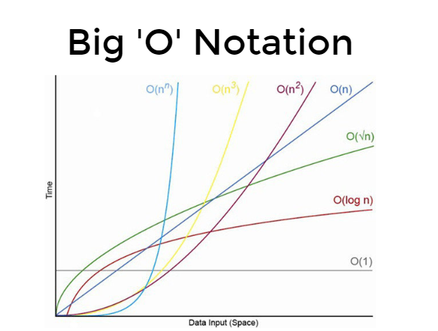
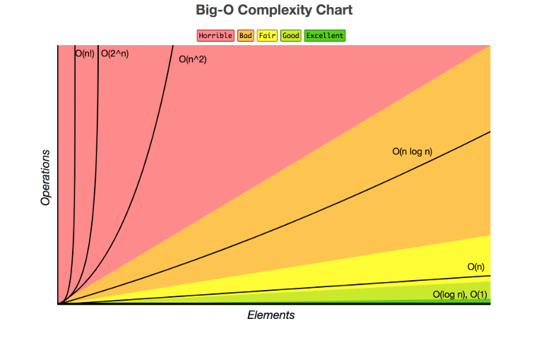

## Space & Time Complexity

##### 1. Introduction Space & Time Complexity

- Space Complexity (How much **memory** is used?)
- Time Complexity (How many primitive **operations** are executed?): Time complexity of an algorithm signifies the total time required by the program to run to completion. The time complexity of algorithms is most commonly expressed using the big O notation.
- Big O notation gives us an industry-standard language to discuss the performance of algorithms. Not knowing how to speak this language can make you stand out as an inexperienced programmer.

| Big-O, name       | # of Operations | Algorithm                        |
| ----------------- | --------------- | -------------------------------- |
| O(n^2), quadratic | n^2             | Compare all numbers              |
| O(n), linear      | 2n              | Find min and max numbers         |
| O(1), constant    | 2               | Sorted list, find first and last |

**FAST** -------------------------------------------------------------------------> **SLOW**

| Name     | constant | logarithmic | linear | quadratic | exponential |
| -------- | -------- | ----------- | ------ | --------- | ----------- |
| Natation | O(1)     | O(logn)     | O(n)   | O(n^2)    | O(k^n)      |

**Complexity of Common Operations**

| Complexity | Operation                                      |
| ---------- | ---------------------------------------------- |
| O(1)       | Running a statement                            |
| O(1)       | Value look-up on an array, object, variable    |
| O(logn)    | Loop that cuts problem in half every iteration |
| O(n)       | Looping through the values of an array         |
| O(n^2)     | Double nested loop                             |
| O(n^3)     | Triple nested loop                             |

#### Useful Resources for Algorithms

| Title             | Link                            |
| ----------------- | ------------------------------- |
| Big O Cheat Sheet | https://www.bigocheatsheet.com/ |
| GeeksforGeeks     | https://www.geeksforgeeks.org/  |
